# go-dynamodb-streams-practice

DynamoDB Streams の勉強用

Streams 経由で、VPC 内の RDS に INSERT 処理を行う

## インフライメージ



## デプロイ

-   `./aws-cdk`ディレクトリ内で定義
-   以下を参考にデプロイする
    -   https://dev.classmethod.jp/articles/cdk-rds-proxy-api-go/

## 環境構築

-   `docker`ディレクトリで定義

```
docker-compose up -d
```

-   dynamodb には、`dynamodb-local`を利用している
-   dynamodb-local 起動後に以下のスクリプトを実行

```
cd docker/dynamodb

sh setup.sh
```

## Mysql のテーブル構造

-   users

    -   user 情報を格納しているテーブル

-   tweets

    -   ツイート内容を格納しているテーブル

-   favorite_tweets
    -   ユーザがお気に入り登録した、ツイート一覧を保持する
    -   ReadModel を想定してるため、users テーブルと tweets テーブルをあらかじめ JOIN した以下のようなデータが入る

```
MySQL [examples]> select * from favorite_tweets;
+----+--------------------------------------+--------------------------------------+---------+---------------------+---------------------+
| id | user_uuid                            | tweet_id                             | content | created_at          | updated_at          |
+----+--------------------------------------+--------------------------------------+---------+---------------------+---------------------+
|  1 | 7fb0fa17-fd76-11eb-a30d-0a31137a3c09 | be685510-fd76-11eb-a30d-0a31137a3c09 | tweet1  | 2021-08-15 06:08:37 | 2021-08-15 06:08:37 |
|  2 | 7fb0fa17-fd76-11eb-a30d-0a31137a3c09 | bfa1094e-fd76-11eb-a30d-0a31137a3c09 |         | 2021-08-15 06:09:26 | 2021-08-15 06:09:26 |
|  3 | 7fb0fa17-fd76-11eb-a30d-0a31137a3c09 | c1d97aa4-fd76-11eb-a30d-0a31137a3c09 | tweet4  | 2021-08-15 06:09:51 | 2021-08-15 06:09:51 |
|  4 | 7fb0fa17-fd76-11eb-a30d-0a31137a3c09 | d876af0f-fd76-11eb-a30d-0a31137a3c09 | tweet3  | 2021-08-15 06:10:07 | 2021-08-15 06:10:07 |
+----+--------------------------------------+--------------------------------------+---------+---------------------+---------------------+
4 rows in set (0.00 sec)

```
